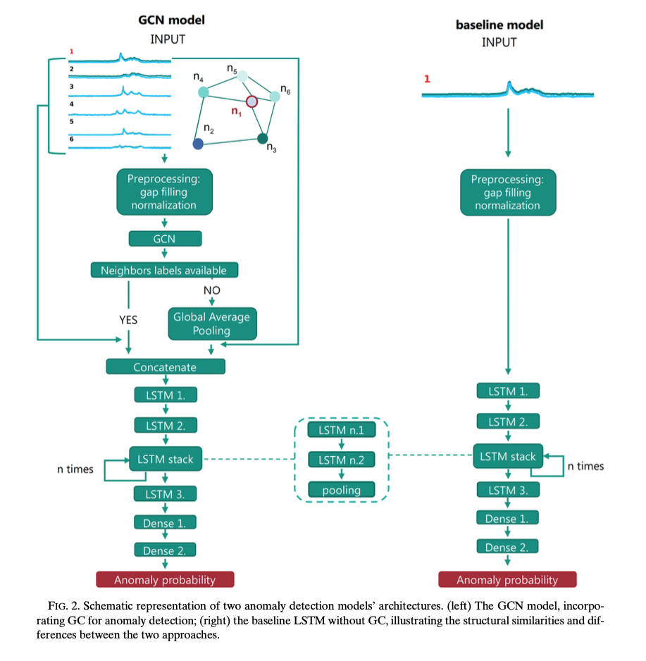
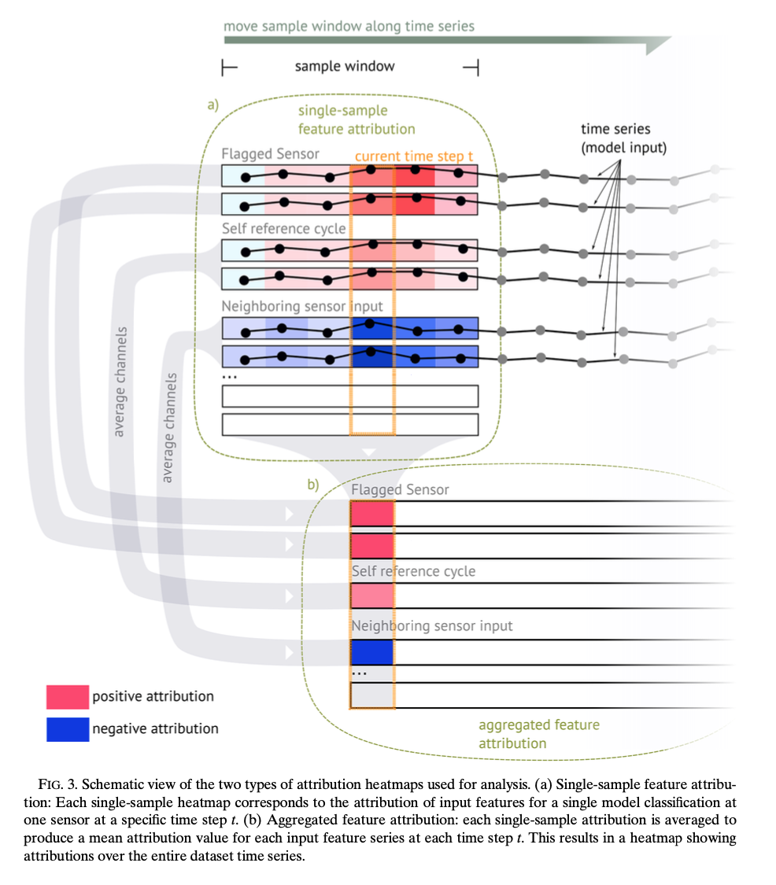

This repository contains the implementation of graph convolutional network (GCN)-based anomaly detection for environmental sensor networks. The code accompanies the research presented in the paper:

## **[Interpretable Quality Control of Sparsely Distributed Environmental Sensor Networks Using Graph Neural Networks](https://journals.ametsoc.org/view/journals/aies/4/1/AIES-D-24-0032.1.xml?tab_body=supplementary-materials)** <br>
ELŻBIETA LASOTA, TIMO HOUBEN, JULIUS POLZ, LENNART SCHMIDT, LUCA GLAWION, DAVID SCHÄFER, JAN BUMBERGER, AND CHRISTIAN CHWALA <br>
published in [Artificial Intelligence for the Earth Systems](https://journals.ametsoc.org/view/journals/aies/aies-overview.xml) in January 2025. <br>


**Abstract**

Environmental sensor networks play a crucial role in monitoring key parameters essential for understanding Earth’s systems. To ensure the reliability and accuracy of collected data, effective quality control (QC) measures are essential. Conventional QC methods struggle to handle the complexity of environmental data. Conversely, advanced techniques such as neural networks are typically not designed to process data from sensor networks with irregular spatial distribution. In this study, we focus on anomaly detection in environmental sensor networks using graph neural networks, which can represent sensor network structures as graphs. We investigate its performance on two datasets with distinct dynamics and resolution: commercial microwave link (CML) signal levels used for rainfall estimation and SoilNet soil moisture measurements. To evaluate the benefits of incorporating neighboring sensor information for anomaly detection, we compare two models: graph convolution network (GCN) and a graph-less baseline: long short-term memory (LSTM). Our robust evaluation through a five-fold cross validation demonstrates the superiority of the GCN models. For CML, the mean area under receiver operating characteristic curve for the GCN was 0.941 compared to 0.885 for the baseline LSTM, and for SoilNet, it was 0.858 for GCN and 0.816 for the baseline LSTM. Visual inspection of CML time series revealed that the GCN proficiently classified anomalies and remained resilient against rain-induced events often misidentified by the baseline LSTM. However, for SoilNet, the advantage of GCN was less pronounced, likely due to inconsistent and less precise labeling. Through interpretable model analysis, we demonstrate how feature attributions vividly illustrate the significance of neighboring sensor data, particularly in distinguishing between anomalies and expected changes in the signal level in the time series.

© 2025 American Meteorological Society. This published article is licensed under the terms of the default AMS reuse license. For information regarding reuse of this content and general copyright information, consult the AMS Copyright Policy (www.ametsoc.org/PUBSReuseLicenses).

Corresponding author: Christian Chwala, christian.chwala@kit.edu

doi: [https://doi.org/10.1175/AIES-D-24-0032.1](https://doi.org/10.1175/AIES-D-24-0032.1)

## If you use this code, please cite the paper as follows:

```bibtex
@article { InterpretableQualityControlofSparselyDistributedEnvironmentalSensorNetworksUsingGraphNeuralNetworks,
      author = "Elżbieta Lasota and Timo Houben and Julius Polz and Lennart Schmidt and Luca Glawion and David Schäfer and Jan Bumberger and Christian Chwala",
      title = "Interpretable Quality Control of Sparsely Distributed Environmental Sensor Networks Using Graph Neural Networks",
      journal = "Artificial Intelligence for the Earth Systems",
      year = "2025",
      publisher = "American Meteorological Society",
      address = "Boston MA, USA",
      volume = "4",
      number = "1",
      doi = "10.1175/AIES-D-24-0032.1",
      pages=      "e240032",
      url = "https://journals.ametsoc.org/view/journals/aies/4/1/AIES-D-24-0032.1.xml"
}
```

---
# Interpretable Quality Control of Environmental Sensor Networks Using Graph Neural Networks

The provided scripts enable anomaly detection using both a GCN model and a baseline model. The architectures of these models are visualized in the figure below:



---

## Supported Datasets

The code is compatible with two datasets:

- **CML (Commercial Microwave Links):** This dataset consists of measurements from microwave communication links, often used for rainfall estimation.  
- **SoilNet:** A network of soil moisture sensors with varying depths, designed to monitor soil conditions over time.  

Sample datasets for both are included in the `./sample_data` folder to help you get started.

---

## Getting Started

### Included Notebook

The core functionality is demonstrated in the notebook:  
**`./notebooks/pipeline.ipynb`**

This notebook walks you through the entire workflow:
1. **Loading Configuration Files:**  
   The notebook uses two configuration files located in `./libs/config`:  
   - **`preprocessing_config.yml`:** Defines preprocessing settings and dataset-specific parameters.  
   - **`model_config.yml`:** Specifies model architecture and training parameters.

2. **Dataset Preprocessing:**  
   - Raw datasets (e.g., NetCDF files for CML or soil sensor data) are converted into TFRecords for model training.
   - For CML, an intermediate step generates individual NetCDF files for each sensor.

3. **Model Training and Evaluation:**  
   - Train the GCN model based on the defined graph structure and parameters.  
   - Evaluate its performance and compare it to the baseline model.  
   - Visualize classified time series and evaluate results.

---

### Key Configuration Parameters

#### Preprocessing Configuration (`preprocessing_config.yml`)

- **Dataset Type:**  
  - `ds_type`: Choose between `cml` or `soilnet`.  
- **Time Series Settings:**  
  - `timestep_before` and `timestep_after`: Define the length of time series segments before and after the target timestamp for anomaly detection.  
  - `min_date` and `max_date`: Define the date range for model development.  
- **Graph Parameters:**  
  - `max_sample_distance` (CML): Defines the radius (in kilometers) around a target sensor for constructing the graph.  
  - `max_neighbour_distance`: Maximum distance between connected sensors, defined in kilometers for CML and in meters for SoilNet.  
  - `max_neighbour_depth` (SoilNet): Defines the allowable depth difference for neighboring soil sensors.  
- **Output Paths:**  
  - `raw_dataset_path`: Path to raw data files.  
  - `tfrecords_dataset_dir`: Directory for saving processed TFRecords.  
- **Data Splits:**  
  - `train_fraction` and `val_fraction`: Specify proportions of data for training and validation.

#### Model Configuration (`model_config.yml`)

- **GCN Model Settings:**  
  - `graph_convolution`:  
    - `layer`: Type of graph convolution layer, options are `'GeneralConv'` or `'AGNNConv'`.  
    - `units`: Number of units in each convolution layer.  
  - `sequence_layer`:  
    - `filter_1_size`: Number of units in the first layer, increasing in subsequent layers.  
    - `n_stacks`: Number of sequential layers.  
  - `dense`: Number of neurons in the final dense layer.  
- **Baseline Model Settings:**  
  - Similar to GCN but in a simplified format.  
- **Output Settings:**  
  - `model_path`: Directory to save the trained models.  
  - `plotting`: Parameters for visualization.

---

### Running the Pipeline

1. **Preprocessing:**  
   Use the provided sample configuration files (e.g., `preprocessing_config_cml.yml` and `model_config_cml.yml`) to preprocess the sample datasets.  
   Note: For CML data, ensure the intermediate NetCDF files are generated for each sensor before creating TFRecords.

2. **Training:**  
   Train the GCN or baseline model using the preprocessed data. Adjust model settings as needed in `model_config.yml`.

3. **Evaluation:**  
   Compare the performance of the GCN and baseline models, and visualize the results.

---

## Example Configurations

The repository includes sample configurations for both datasets:  
- **CML:** `preprocessing_config_cml.yml` and `model_config_cml.yml`.  
- **SoilNet:** `preprocessing_config_soilnet.yml` and `model_config_soilnet.yml`.

These configurations can be used to quickly test the pipeline with the provided data and models.

---

## Notes

- TFRecord generation is a one-time process unless parameters like time series length or graph structure are modified.  
- Model training results are saved to the directory specified in the configuration files.

---

Feel free to explore the repository and experiment with different configurations! For any questions or issues, please open an issue in this repository.

---

# Neighboring Sensor Contribution through XAI with Integrated Gradients

The code for the integrated gradient analysis is available in the `./xai` folder. 

The script 
- `./xai/libs/integrated_gradients.py` calculates the gradients, visualizes intermediate steps, and generates an attribution map for each sample. 
 
The script 
- `./xai/libs/integrated_gradients_analyser.py` processes the results and generates visualizations for selected samples from a selected time period. 

The config
- `./xai/libs/config/xai_config_20240318.yml` configures the XAI workflow.

The following scripts were used to produce the XAI results in the paper:
- `./xai/notebooks/run_integrated_gradients_20240318.py`
- `./xai/notebooks/run_integrated_gradients_analyser_20240318.py`

The XAI part was developed at an earlier stage of the project and is not fully integrated into the final code. However, the scripts and files integrated in the `./xai` folder can be used to reproduce the XAI analysis presented in the paper with the status of the GNN model running at that time.

The XAI analysis was subdivided into two parts

- **a) -  Single-sample feature attribution and**
- **b) - Aggregated feature attribution (see image below).**




